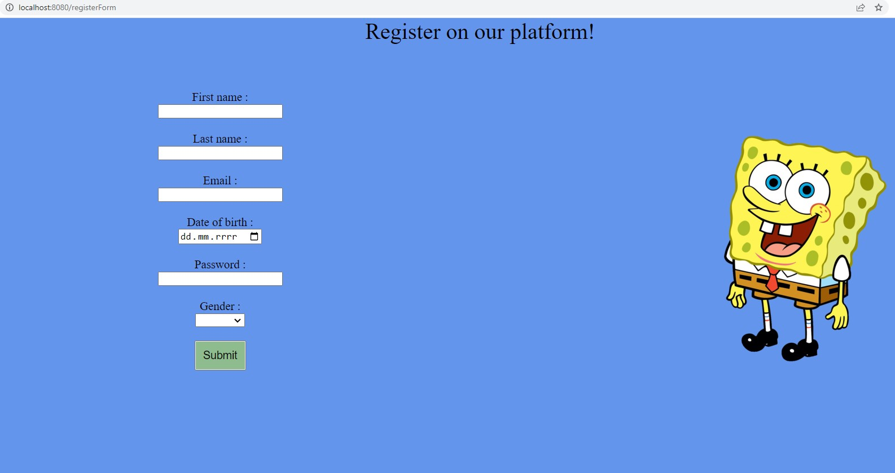

# User Panel

> User Panel where you can register user and logging in.

## Table of Contents

* [General Info](#general-information)
* [Technologies Used](#technologies-used)
* [Features](#features)
* [Screenshots](#screenshots)
* [Setup](#setup)
* [Project Status](#project-status)
* [Room for Improvement](#room-for-improvement)
* [Contact](#contact)

## General Information

In this project we register a user. We can log in anytime to our account.
Purpose of this project is to connect SpringBoot Application with database, using simple frontend
and thymeLeaf.

<!-- You don't have to answer all the questions - just the ones relevant to your project. -->

## Technologies Used

- Java 11
- SpringBoot 3.1.1
- Docker
- MySQL
- ThymeLeaf
- Maven
- Html
- Css

## Features

- Register user on page then store information in database
- Logging on page using stored information from database

## Screenshots

## Setup

To run this project we have to

- install java 11
- check dependencies on maven file
- configure src.main.resources.application.properties file to connect with database

## Project Status

Project is: _in progress_

## Room for Improvement

To do:

## Contact

Created by Tomasz, [tdmz@o2.pl](https://www.flynerd.pl/) - feel free to contact me!

